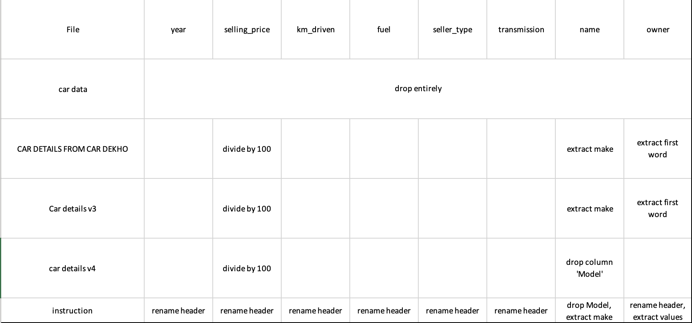

# Ironhack midterm project - Used cars price prediction

[Project's repository](https://github.com/vlad-lis/Ironhack-midterm)

## Members of the group:
* Markus Schmidt
* Vladislav Lis

## Goal of the project:
Creating a model to predict prices for used cards.

## Description of the dataset:
[Vehicle dataset](https://www.kaggle.com/datasets/nehalbirla/vehicle-dataset-from-cardekho) found on Kaggle.

The combined dataset has up to 14,828 rows spread over 4 csvs. Every csv has a different amount of columns, different header names and the data is formatted in different styles.
Columns range from 8 to 20 so we will most likely use 6 columns if there is not enough overlap.
After the EDA and data cleaning we will most likely have to drop some rows and columns in case we cannot use all of the rows because of the aformentioned situation.

## Planning:
* Day 1 - EDA:  
  * Getting insights from the data set;
  * Checking for outliers and anomalies;
  * Determining correlation between variables.
* Day 2 - Cleaning the data:
  * Removing null vales;
  * Correcting data types;
  * Checking for duplicates;
  * Filtering unwanted outliers.
* Day 3 - Transforming the data:
  * Creating an overview pairplot (seaborn) to check for correlation;
  * Scaling numerical features;
  * Encoding categorical features.
* Day 4 - Modelling:
  * Creating a model;
  * Testing the model;
  * Comparing predicted and test results;
  * Plotting test results;
  * Presentation preparation.
  * _optional:_
    * tableau dashboard for the initial data set;
* Day 5 - Presentation:
  * Presenting the model.

## Day 1 - EDA:
* EDA plan for data preparation before concatenation described in [.xls file ](https://github.com/vlad-lis/Ironhack-midterm/blob/main/EDA/EDA_planning.xlsx):

* EDA results:
  * 'car data.csv' has anomalies in feature values; the file is ignored in the analysis due to its low statistical value with only 300 rows.
  * 'model' and 'engine' categorical columns have too many unique values; these columns will be ignored for the final data set due to the amount of dummified columns they would create after normalizing the data.
  * 'seats' column has nine unique values and will be used as the closest present alternative to vehicle type.
  * in order to concatenate the csv files into one dataframe columns 'location', 'color', 'mileage', 'max power', 'max torque', 'drivetrain', 'length', 'width', 'height', 'fuel tank capacity' will be ignored, since they are not present in each file.
  * concatenating three csv files will result in a dataframe with roughly over 14k observations.
  * no outliers require removal.

## Day 2 - Data cleaning results:
* extracted the first word (Make) in the 'name' and 'owner' columns.
* dropped extra columns.
* formatted 'selling price' column.
* concatenated three files into a new dataframe.
* checked for null values (there aren't any).
* checked for duplicates (2.2k duplicated found) and droppped them.
* check data types (all correct).